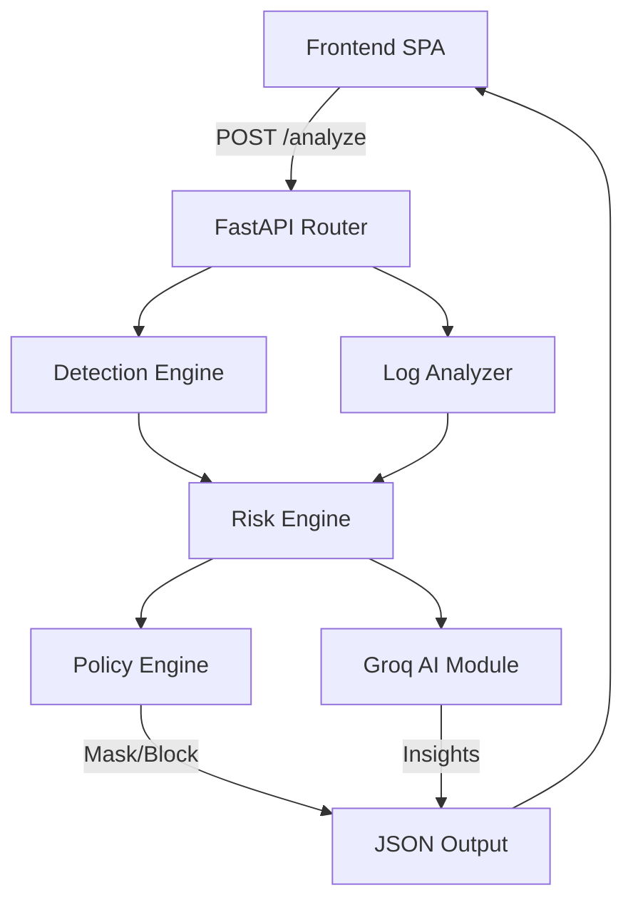

# AI Secure Data Intelligence Platform (SISA)

A complete, real-time AI-powered security scanning platform. It scans text, SQL queries, chat logs, and raw server logs to detect sensitive data (PII, credentials, API keys) and security threats (SQL injections, brute-force attacks) using a hybrid rule-based and AI (Groq Llama 3) engine.

 *(Note: add a screenshot to your repo root named `screenshot.png` to display here)*

## 🚀 Features

- **Multi-format Scanning**: Supports plain text, SQL, Chat, and Log files (`.log`, `.txt`, `.pdf`, `.docx`).
- **13 Detection Patterns**: Detects AWS keys, SQL injection payloads, plain-text passwords, credit cards, stack traces, and more.
- **Smart Data Masking**: Automatically redacts sensitive substrings before they hit your logs or DB.
- **Log Analyzer**: Line-by-line parsing with brute-force (failed login streaks) and stack-trace anomaly detection.
- **Policy Engine**: Configurable rules to mask data, allow safe content, or completely block high-risk payloads.
- **AI Security Insights**: Uses **Groq (llama3-8b-8192)** to generate actionable remediation steps (with full rule-based fallback if offline).

## 🛠️ Tech Stack

**Backend**
- Python 3.11+
- FastAPI (High-performance async API framework)
- Uvicorn (ASGI server)
- Groq SDK (AI insights)
- PyPDF & python-docx (File parsing)

**Frontend**
- Vanilla HTML5 / CSS3 / JavaScript (Zero framework overhead)
- Full Single Page Application (SPA) architecture
- DM Sans & DM Mono fonts

## 🏗️ Architecture



## 💻 Local Development

1. **Clone the repository**
   ```bash
   git clone https://github.com/MANISH4333/SISA-PROJECT.git
   cd SISA-PROJECT
   ```

2. **Set up the backend environment**
   ```bash
   cd aisecure/backend
   pip install -r requirements.txt
   ```

3. **Configure Environment Variables (Optional but recommended)**
   Copy the example env file in the project root:
   ```bash
   cd ../..
   cp aisecure/.env.example aisecure/.env
   ```
   Edit `aisecure/.env` and add your free [Groq API Key](https://console.groq.com/keys):
   `GROQ_API_KEY=gsk_your_key_here`

4. **Start the API Server**
   ```bash
   cd aisecure/backend
   python -m uvicorn main:app --host 0.0.0.0 --port 8000 --reload
   ```

5. **Open the App**
   Navigate to [http://localhost:8000](http://localhost:8000) in your browser. The frontend is served directly by FastAPI.

---

## 🌍 Vercel Deployment

This project includes a `vercel.json` file configured for serverless Python deployment.

1. Go to your [Vercel Dashboard](https://vercel.com/new).
2. Click **Add New... > Project** and import `MANISH4333/SISA-PROJECT`.
3. Leave the Framework Preset as **Other** (Vercel will auto-detect Python).
4. **Environment Variables**:
   Add a new variable:
   - **Name**: `GROQ_API_KEY`
   - **Value**: `gsk_...` (your key)
5. Click **Deploy**.

Vercel will automatically install the requirements and launch the FastAPI app as a serverless function, serving the `index.html` file at the root URL.

## 📁 Project Structure

```text
SISA-PROJECT/
├── vercel.json                  # Vercel deployment config
├── .gitignore                   # Git ignore rules
└── aisecure/
    ├── .env.example             # Template for API keys
    ├── backend/
    │   ├── main.py              # FastAPI endpoints & static server
    │   ├── detection_engine.py  # 13 regex + masking logic
    │   ├── log_analyzer.py      # Multi-line log & anomaly logic
    │   ├── ai_module.py         # Groq LLM integration & fallback
    │   ├── risk_engine.py       # Score aggregation (0-20)
    │   ├── policy_engine.py     # Mask/Block/Allow thresholds
    │   └── requirements.txt     # Python dependencies
    └── frontend/
        └── static/
            └── index.html       # Full SPA interface (HTML/CSS/JS)
```
